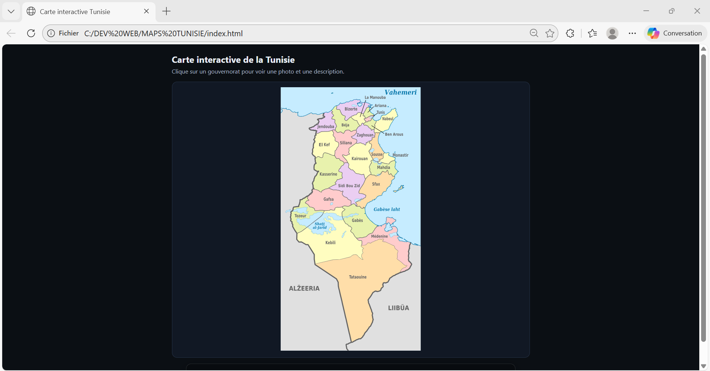
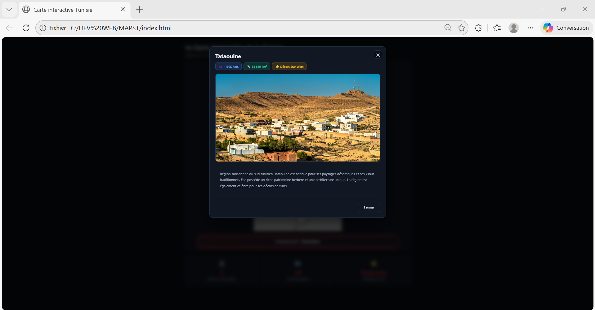
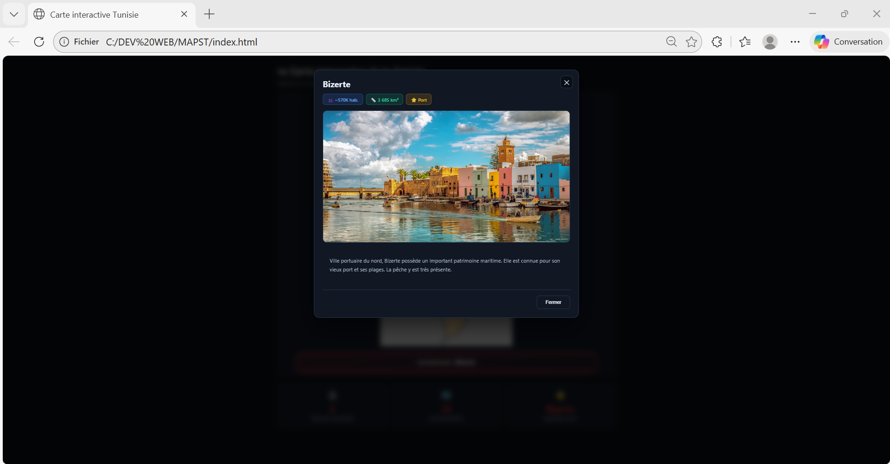
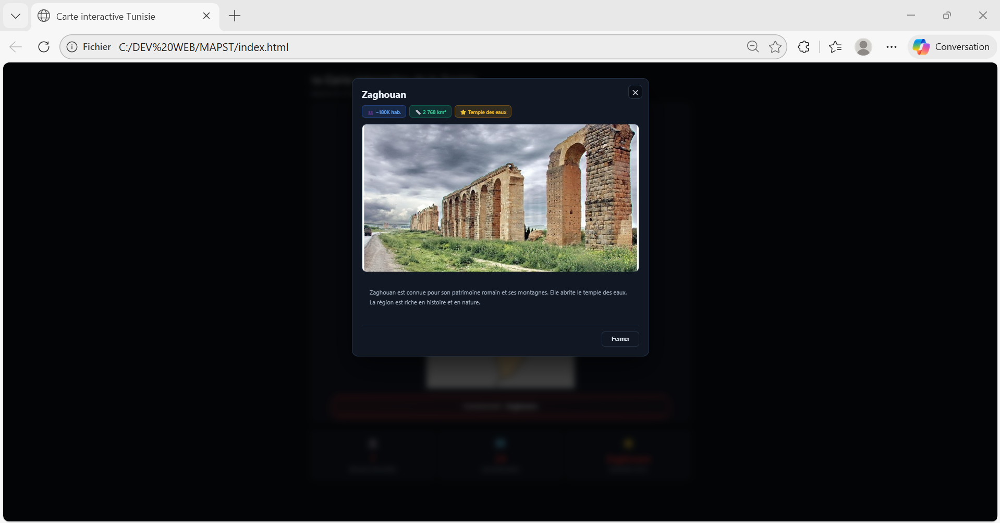

# 🇹🇳 Carte Interactive de la Tunisie

Ce projet est une **carte interactive de la Tunisie** développée en **HTML, CSS et JavaScript**.  
Il permet à l’utilisateur de cliquer sur chaque gouvernorat afin d’afficher dynamiquement des informations via une fenêtre modale.

L’objectif est de proposer une **visualisation claire, intuitive et interactive** des régions tunisiennes.

---

##  Présentation du Projet

La carte est réalisée à partir d’un **SVG interactif**, manipulé en JavaScript pour gérer :
- les clics sur les gouvernorats  
- l’affichage des fenêtres modales  
- l’adaptation à la taille de l’écran  

---

##  Captures d’Écran du Projet

###  Carte Interactive de la Tunisie

---

###  Interaction et Sélection des Gouvernorats

---

###  Fenêtre Modale d’Information

---

###  Affichage Responsive

---
